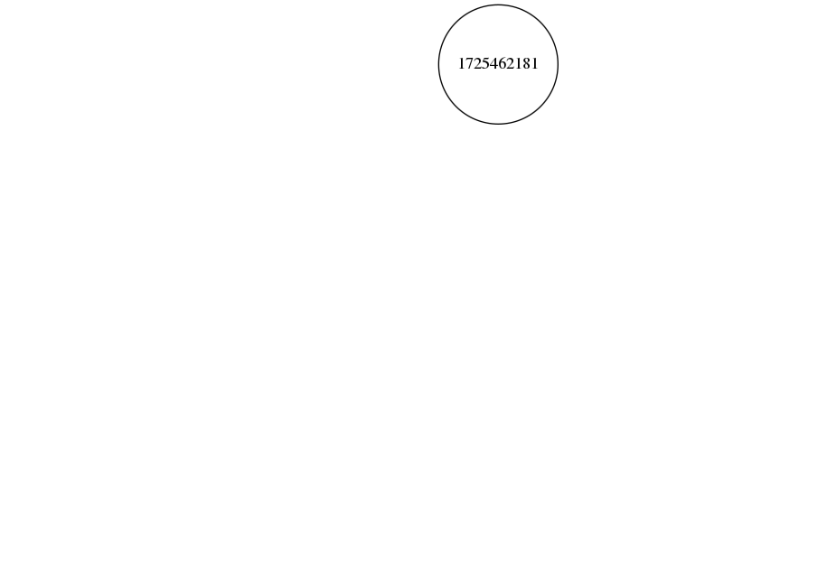

#二分木gif画像生成スクリプト
自作二分木クラスのBinTree<T>::animation(std::string dir)を使って得られたpng画像からルートを固定した見やすいgif画像を生成するスクリプト

## 使いかた
0.png ~ N.pngまでカレントディレクトリにあることを前提にして、
```
./make_gif.sh
```

## 仕組み
1. ./biggest_size.pyで一番大きい画像のサイズを取得
1. それぞれのpngをその大きさに統一して、BMPに変換
1. ./calc_offset.pyで「左端のノードから、ルートノードまでの横方向の差が最も大きいノード」のルートノード座標を取得
1. 上で取得した座標にルートノードを合わせるように各画像を移動
1. gifにする
